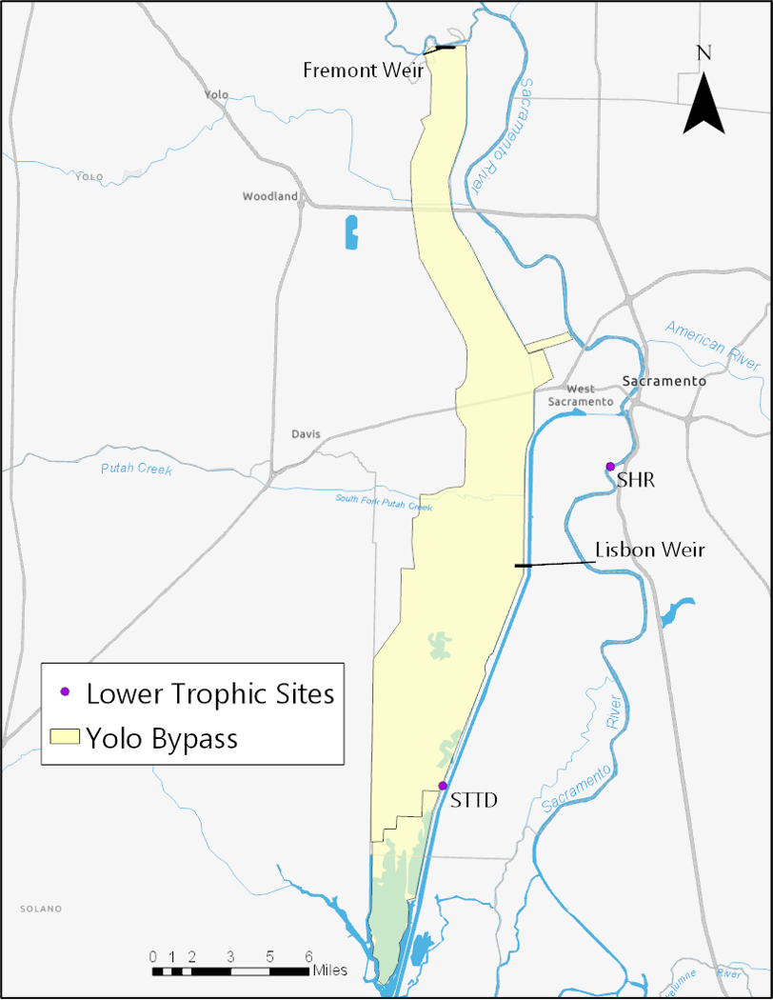

```{r setup, include=FALSE}
knitr::opts_chunk$set(echo = FALSE, warning = FALSE, message = FALSE)
```


```{r}
library(EML)
library(dplyr)
library(knitr)
```


```{r}
title <- "Interagency Ecological Program: Discrete water quality data from the Sacramento River floodplain and tidal slough, collected by the Yolo Bypass Fish Monitoring Program, 1998 - Present"
ab <- set_TextType("abstract.md")
```

## Abstract

```{r, child = 'abstract.md'}
```

## Keywords

```{r}
keywords <- c("Yolo Bypass", "San Francisco Estuary", "Sacramento-San Joaquin Delta", "Yolo Bypass Fish Monitoring Program", "California Department of Water Resources", "Interagency Ecological Program", "tidal slough", "water quality", "nutrients", "chlorophyll", "cations", "anions")
```

```{r}
kable(keywords, col.names = NULL)
```


## Personnel


```{r}
people <- read.csv("personnel.csv", na.strings = c("NA", ""))

cres_df <- people %>% 
    filter(element == "creator")

cres <- list()
for (i in 1:nrow(cres_df)){
    cres[[i]] <- eml$creator(individualName = eml$individualName(givenName = cres_df$givenName[i],
                                                                 surName = cres_df$surName[i]),
                             organizationName = cres_df$organization[i],
                             electronicMailAddress = cres_df$organization[i])
    
    if (!is.na(cres_df$orcid[i])){
        cres[[i]]$userId <-list(directory = "orcid", userId = paste0("https://orcid.org/", cres_df$orcid[i]))
    }
    
}

cons_df <- people %>% 
    filter(element == "contact")

cons <- list()
for (i in 1:nrow(cons_df)){
    cons[[i]] <- eml$creator(individualName = eml$individualName(givenName = cons_df$givenName[i],
                                                                 surName = cons_df$surName[i]),
                             organizationName = cons_df$organization[i],
                             electronicMailAddress = cons_df$organization[i])
    
    if (!is.na(cons_df$orcid[i])){
        cons[[i]]$userId <-list(directory = "orcid", userId = paste0("https://orcid.org/", cons_df$orcid[i]))
    }
    
}


ap_df <- people %>% 
    filter(element == "associatedParty")

aps <- list()
for (i in 1:nrow(cons_df)){
    aps[[i]] <- eml$creator(individualName = eml$individualName(givenName = ap_df$givenName[i],
                                                                 surName = ap_df$surName[i]),
                             organizationName = ap_df$organization[i],
                             electronicMailAddress = ap_df$organization[i])
    
    if (!is.na(ap_df$orcid[i])){
        aps[[i]]$userId <-list(directory = "orcid", userId = paste0("https://orcid.org/", ap_df$orcid[i]))
    }
    
    aps[[i]]$role <- ap_df$role[i]
    
}


```

#### Creators

```{r}
cres_df %>% 
    select(-element, -middleName) %>% 
    replace(is.na(.), "") %>% 
    kable()
```


#### Contacts

```{r}
cons_df %>% 
    select(-element, -middleName) %>% 
    replace(is.na(.), "") %>% 
    kable()
```

#### Associated Parties

```{r}
ap_df %>% 
    select(-element, -middleName) %>% 
    replace(is.na(.), "") %>% 
    kable()
```

## Temporal Coverage

2011-2022

## Geographic Coverage



**Yolo Bypass tidal slough and seasonal floodplain in Sacramento, California, USA**

*	North bounding coordinates (decimal degrees): 38.79395205 
*	South bounding coordinates (decimal degrees): 38.23466149 
*	East bounding coordinates (decimal degrees): -121.5368316 
*	West bounding coordinates (decimal degrees): - 121.8073699 


```{r}
tc <- set_coverage(beginDate = 2011,
                   endDate = 2022,
                   geographicDescription = "Yolo Bypass tidal slough and seasonal floodplain in Sacramento, California, USA",
                   northBoundingCoordinate = 38.79395205,
                   southBoundingCoordinate = 38.23466149,
                   eastBoundingCoordinate = -121.5368316,
                   westBoundingCoordinate = - 121.8073699 )
```


## Methods

```{r}
    methods <- set_methods("methods.md")
```


```{r, child = 'methods.md'}
```


## License

```{r}
ir <- list(para = "This information is released under the Creative Commons license - Attribution - CC BY (https://creativecommons.org/licenses/by/4.0/). The consumer of these data ('Data User' herein) is required to cite it appropriately in any publication that results from its use. The Data User should realize that these data may be actively used by others for ongoing research and that coordination may be necessary to prevent duplicate publication. The Data User is urged to contact the authors of these data if any questions about methodology or results occur. Where appropriate, the Data User is encouraged to consider collaboration or co-authorship with the authors. The Data User should realize that misinterpretation of data may occur if used out of context of the original study. While substantial efforts are made to ensure the accuracy of data and associated documentation, complete accuracy of data sets cannot be guaranteed. All data are made available 'as is.' The Data User should be aware, however, that data are updated periodically, and it is the responsibility of the Data User to check for new versions of the data. The data authors and the repository where these data were obtained shall not be liable for damages resulting from any use or misinterpretation of the data. Thank you.")
```


This information is released under the [Creative Commons license - Attribution - CC BY](https://creativecommons.org/licenses/by/4.0/). The consumer of these data ("Data User" herein) is required to cite it appropriately in any publication that results from its use. The Data User should realize that these data may be actively used by others for ongoing research and that coordination may be necessary to prevent duplicate publication. The Data User is urged to contact the authors of these data if any questions about methodology or results occur. Where appropriate, the Data User is encouraged to consider collaboration or co-authorship with the authors. The Data User should realize that misinterpretation of data may occur if used out of context of the original study. While substantial efforts are made to ensure the accuracy of data and associated documentation, complete accuracy of data sets cannot be guaranteed. All data are made available "as is." The Data User should be aware, however, that data are updated periodically, and it is the responsibility of the Data User to check for new versions of the data. The data authors and the repository where these data were obtained shall not be liable for damages resulting from any use or misinterpretation of the data. Thank you.

## Funding

This project was funded by the State Water Project

```{r}
proj <- eml$project(title = title,
                    personnel = aps,
                    funding = eml$funding(para = "State Water Project"))
```


```{r, results = "hide"}
doc <- list(
           packageId = "1",
           system = "local", # type of identifier
           dataset = eml$dataset(title = "Interagency Ecological Program: Discrete water quality data from the Sacramento River floodplain and tidal slough, collected by the Yolo Bypass Fish Monitoring Program, 1998 - Present",
                          abstract = ab,
                          creator = cres,
                          contact = cons,
                          associatedParty = aps,
                          methods = methods,
                          coverage = tc,
                          intellectualRights = ir,
                          project = proj))

write_eml(doc, "metadata.xml")
```

